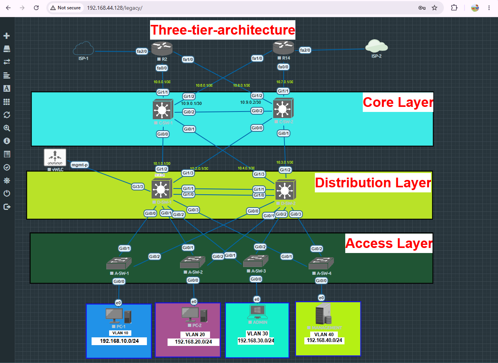

# Three-Tier Enterprise Network

This is a lab I built in EVE-NG while preparing for my CCNA — the goal was to move past isolated topic labs (just OSPF, just VLANs, just NAT) and put everything together the way it would actually look in a small business network: dual ISP edge, a proper three-tier hierarchy, redundancy at every layer, and some centralized services running on a Linux box because a real network doesn't just route packets, it also needs to be monitored and managed.

I've broken the write-up down by layer since that's how I actually built and tested it — bottom-up from access, then distribution, then core, then the edge.

## Topology

                         ISP-1                              ISP-2
                           |                                   |
                        [ R2 ]  ─────────────────────────  [ R14 ]
                           |                                   |
                 ┌──────────────────────────────────────────────┐
                 │                  CORE LAYER                    │
                 │       C-SW-1  ══════════════════  C-SW-2        │
                 └──────────────────────────────────────────────┘
                           |          ╲        ╱          |
                 ┌──────────────────────────────────────────────┐
                 │              DISTRIBUTION LAYER                │
                 │       D-SW-1  ══════════════════  D-SW-2        │── WLC
                 └──────────────────────────────────────────────┘
                    |          |             |            |
                 ┌──────────────────────────────────────────────┐
                 │                 ACCESS LAYER                   │
                 │   A-SW-1     A-SW-2      A-SW-3      A-SW-4    │
                 └──────────────────────────────────────────────┘
                    |            |             |            |
                 VLAN 10      VLAN 20      VLAN 30       VLAN 40
              192.168.10.0/24  .20.0/24     .30.0/24      .40.0/24
Every access switch has two uplinks, crossed to both distribution switches. Every distribution switch has two uplinks, crossed to both core switches. So a single link or switch dying anywhere in the middle doesn't take a VLAN offline — traffic just reconverges through the other path.

---

## Access Layer — A-SW-1 to A-SW-4

This is where the actual VLANs get created and where end devices plug in.

- Created VLANs 10, 20, 30, 40 on each access switch and assigned the access ports accordingly (one VLAN per switch in this build, though the switches are trunked for all VLANs so it's not hard-locked to that).
- Uplinks to both distribution switches are trunk ports carrying all four data VLANs plus the management VLAN.
- Added a management VLAN (VLAN 99) with an SVI on every access switch, purely for out-of-band-style access — SSH into the switches, not into user traffic. ip default-gateway on each switch points to the HSRP virtual IP for VLAN 99 sitting on distribution, since these are Layer 2 switches without ip routing enabled.
- SSH enabled on all four switches (domain name, RSA keys, VTY lines locked to SSH only, Telnet disabled) so nobody's managing these in plaintext.

Small thing I ran into here worth noting: after adding VLAN 99, one of the access switches kept the VLAN 99 SVI down even though the config looked identical to the others. Turned out the trunk wasn't carrying VLAN 99 on that particular link yet — switchport trunk allowed vlan add 99 fixed it. Good reminder that an SVI won't come up just because it exists; it needs at least one forwarding port in that VLAN.

---

## Distribution Layer — D-SW-1 & D-SW-2

This is the busiest layer in the whole design — it's doing routing, redundancy, aggregation, and policy enforcement all at once.

Inter-VLAN routing happens here via SVIs, not on a router-on-a-stick setup. Wanted wire-speed routing instead of everything squeezing through one sub-interfaced link, and it lines up naturally with where HSRP needs to live anyway.

HSRP is configured per VLAN, with priorities alternated between D-SW-1 and D-SW-2 so that, say, D-SW-1 is active for VLAN 10/30 while D-SW-2 is active for VLAN 20/40. That way both switches are actually forwarding traffic under normal conditions instead of one sitting idle as a pure backup.

EtherChannel (LACP) bundles the two physical links between D-SW-1 and D-SW-2 into a single logical link — needed this specifically because without it, STP was just going to block one of the two parallel links anyway, so might as well get the extra bandwidth out of it instead of wasting a whole physical interface.

OSPF runs from distribution up into the core, redistributing/propagating the default route down so VLANs can actually reach the internet through NAT on the edge routers.

SSH is configured the same way as access layer — no Telnet anywhere in this topology.

ACLs — this was the last thing I added. Extended ACLs applied inbound on the VLAN SVIs to enforce actual segmentation instead of just relying on "different VLANs" as a security boundary:
- VLAN 10 and VLAN 20 (general user VLANs) can reach VLAN 30 (server/admin VLAN) and the internet, but can't talk to each other or to VLAN 40.
- VLAN 40 (management/services network — this is where the Ubuntu server lives) only accepts traffic from VLAN 30. Everything else gets dropped.
- VLAN 30 stays unrestricted since that's the admin/trusted segment.

Also connected the WLC here on a trunk port, since distribution is the natural Layer 2/3 boundary for a controller that needs to map VLANs to SSIDs. VLAN 99 handles its management interface; the trunk also carries the data VLANs so it's ready to go the moment an AP is available (I didn't have one to test with in this simulation, so the WLC is configured and reachable via GUI, but I couldn't demonstrate an actual wireless client associating).

---

## Core Layer — C-SW-1 & C-SW-2

Kept this layer intentionally simple — its only job is to move traffic fast between distribution and the edge, not to make decisions about it.

- HSRP for gateway redundancy on the core-facing links.
- EtherChannel (LACP) between C-SW-1 and C-SW-2, same reasoning as distribution — avoid STP blocking a perfectly good link.
- OSPF adjacency with both the edge routers and the distribution switches, so the whole middle of the network converges dynamically instead of relying on static routes.
- Crossed uplinks in both directions (to edge and to distribution) for the same redundancy pattern used everywhere else in this design.

---

## Edge — R2 & R14

Two edge routers, each homed to a different ISP, with crossed links down into the core so either router can reach either core switch.

- NAT/PAT configured so the internal 192.168.x.x address space can get out to the internet through the ISP-facing interfaces — this is standard overload PAT, not 1:1 NAT.
- OSPF on the internal side, injecting a default route so the rest of the network knows how to get out.
- SSH hardening on both routers, VTY restricted, Telnet off.
- Practiced password recovery (ROMMON, break sequence, config-register manipulation) separately on these as part of the CCNA prep — not part of the live topology, just something I ran through to make sure I actually understood it hands-on instead of just reading about it.

---

## VLAN 40 — Services (Ubuntu Server 22.04)

Instead of leaving network management as a theoretical "you'd use SNMP/Syslog in production" line, I actually stood up a services box in VLAN 40 and hooked the network devices into it. This part's a bit past standard CCNA scope but it's the part of the lab that made the network feel less like a Packet Tracer exercise and more like something that has to be operated day-to-day.

Syslog — rsyslog listening on UDP 514. Every device points its logging at this box (logging host 192.168.40.11), so config changes, interface flaps, etc. all land in one place instead of being scattered across device buffers that get wiped on reload.

SNMP — set up as a manager on the Ubuntu box, polling devices with snmpwalk/snmpget, with a separate read-write community for testing snmpset (used it to remotely change an interface description, just to prove write access actually works and isn't just a theoretical RW string). Community strings are public/private here, which I know isn't something you'd actually ship to production — noting that on purpose, since the real answer for a live network is SNMPv3 with proper auth/encryption, or at minimum a non-default community string.

FTP — vsftpd, mainly used for pulling config backups off the routers/switches (copy running-config ftp://...) so there's an off-device copy if something gets fat-fingered during config changes. Also just useful generally for shuffling files during the lab.

---

## Design notes / things I'd flag if someone reviewed this

- The WLC is functionally configured (interfaces, SSID, mobility group) but I don't have AP hardware or an EVE-NG-compatible virtual AP to actually bring up a CAPWAP tunnel, so wireless client association isn't demonstrated end-to-end here. If I get access to a compatible AP image later, the trunk to distribution is already carrying the client VLANs so it should just be a matter of pointing the AP at the WLC.
- I started building out RADIUS-based centralized authentication (FreeRADIUS on the same Ubuntu box) as a further extension of the AAA concept, but didn't finish debugging it cleanly — local authentication with a fallback is what's actually running right now. Left it out of the final config rather than ship something half-working.
- Default SNMP community strings and a couple of other lab shortcuts are called out above on purpose — didn't want to just quietly leave them in without saying so.

---

## Tools

- EVE-NG (on VMware Workstation) for the topology
- Cisco IOS / IOL images for routers and switches
- Ubuntu Server 22.04 for the services box
- Cisco vWLC 8.10.x

---

Built while working toward CCNA certification — some parts of this go a little beyond exam scope (the services box, ACL policy design, the WLC) because I wanted the lab to hold together as something closer to a real deployment, not just a checklist of exam topics.

